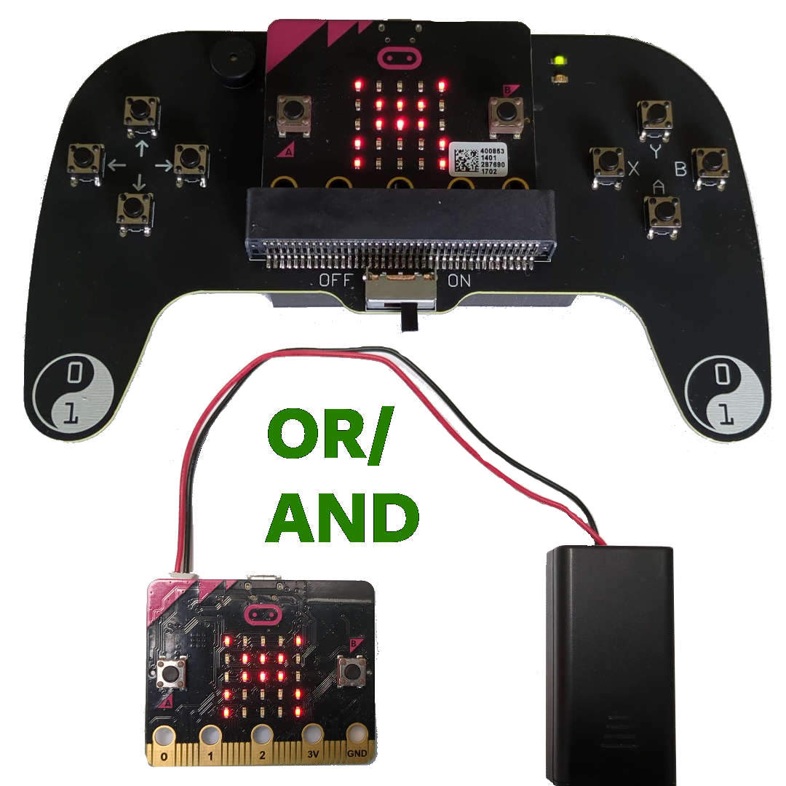
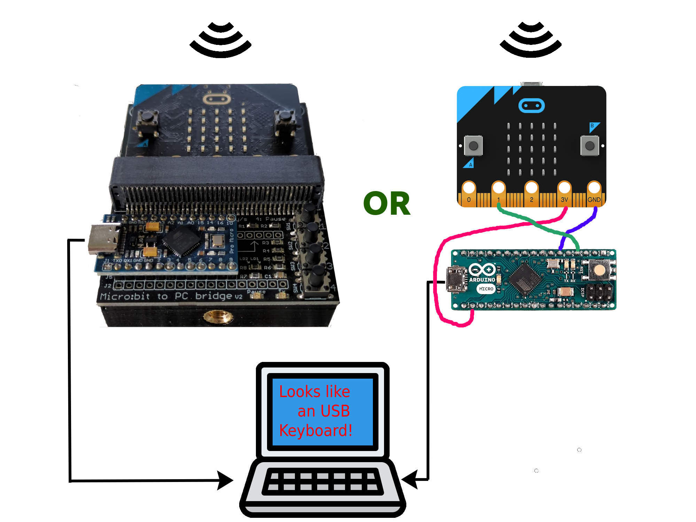

# 26 Player party game setup

Up to 26 senders

go to a single receiver

Sending keys A–Z for 26 players.

## The concept
Up to 26 micro:bits act as wireless game controllers. One micro:bit is used as a receiver. Each time a player presses a button, the receiver micro:bit sends a character (A–Z) to the serial port of the Arduino. The Arduino acts as a virtual keyboard for the PC and passes the player's keystrokes as a–z keypresses (player 1 = a, player 2 = b, ..., player 26 = z).

This has some benefits:
- No drivers required; works on any PC, Mac, Chromebook, tablet, etc.
- Games can be developed without the hardware; just use the keyboard `a`–`z` keys to test!
- Easy to develop!

## Setup
Of course you'll need games to play. Check out [games-examples](games-examples/README.md) for a guide on how to write games or directly try the examples.

### The sender
For the sender you have 2 options:
- A micro:bit with a battery box
- Or build the [game controller](https://github.com/jimd80/pxt-coderdojo-controller)

Load [microbit-GameController-v25.12.hex](sender-microbit-src/microbit-GameController-v25.12.hex) from [sender-microbit-src](sender-microbit-src/README.md) into each sender micro:bit using [MakeCode](https://makecode.microbit.org/#editor) or drag it to the `MICROBIT` folder in your file manager.

### The receiver
Get an Arduino Micro, or the Pro Micro clone. Flash [receiver-arduino-v25.7.hex](receiver-arduino-src/release/receiver-arduino-v25.7.hex) from [receiver-arduino-src](receiver-arduino-src/README.md) into the Arduino.

Get a dedicated micro:bit to use as a receiver. Flash [microbit-GameReceiver-v26.3.hex](receiver-microbit-src/microbit-GameReceiver-v26.3.hex) from [receiver-microbit-src](receiver-microbit-src/README.md) into the receiver micro:bit.

Connect the Arduino and micro:bit with 3 wires, as described in [receiver-arduino-src](receiver-arduino-src/README.md).

Alternatively, build the receiver PCB as described in [receiver-pcb](receiver-pcb/README.md).

## How to play
There are plenty of modes to use this setup. We'll go from easy to advanced.

### Quick 26 player
The easiest and fastest setup to play a multiplayer game.

**Senders**: Players just need to turn on their micro:bit. A `?` will appear shortly and a letter is auto-assigned. Button A is the action key to play.

**Receiver**: Plug in the receiver. `26` will appear briefly on the screen. Press button B until `A` (**A**uto-assign) appears and press button A to confirm.

### Personalized 26 player
The controllers are personalized. Give each player a secret code they need to enter into their micro:bit in order for their predefined letter to appear. If managed well, games can keep a preset list of the players' names to show in-game names of the players. The list of "secret codes" can be found in [sender-microbit-src](sender-microbit-src/README.md).

**Senders**: After a player has powered up their micro:bit, a `?` will appear. Now they need to input their code by pressing A and B alternately. For example, if a code is 4567, then A needs to be pressed 4 times, B 5 times, A 6 times, and B 7 times. After this, their assigned letter will appear on the screen.

**Receiver**: Just plug in the receiver; the default mode will just work.

### Programming challenge 26 player
For an extended experience, you can let the players program their micro:bit by themselves with MakeCode blocks.

**Senders**: Let the players create the code as shown in [sender-microbit-src](sender-microbit-src/README.md) (replacing 9999 with their personal code).

**Receiver**: Just plug in the receiver; the default mode will just work.

### 8 button mode 26 player
Games can be advanced to enable all 8 buttons from each player's controller. In this mode, the game not only needs to look at the letter that was pressed, but also at the preceding number, which indicates the button. Each button press from a player is sent as 2 keystrokes, like `5c` = button 5 for player c. More information can be found in [games-examples](games-examples/README.md).

This mode only works if you have both the [game controller](https://github.com/jimd80/pxt-coderdojo-controller) and [receiver PCB](receiver-pcb/README.md).

**Senders**: Same setup as **Quick 26 player** or **Personalized 26 player**.

**Receiver**: Plug in the receiver. Long-press button 4 on the receiver PCB. The green LED will turn on to indicate multi-button mode.

### 8 button mode 4 player
Another way of enabling all 8 buttons per player is limiting the maximum player count to 4. In this way, all 32 keys (8 x 4) can be mapped to a single key on the keyboard, making game programming much easier than the 8-button 26-player mode above.

This mode only works if you have the [game controller](https://github.com/jimd80/pxt-coderdojo-controller).

**Senders**: Power on the micro:bit so `?` appears. Hold A+B until I, II, III, or IIII shows up on the screen to choose player 1–4.

**Receiver**: Plug in the receiver. Press button A until `4` shows up on the screen. The first row of 4 LEDs shows the online status of controllers 1–4.

### Micro:bit project mode
This mode is not to be used with the receiver, but with another custom-programmed micro:bit controlling their own hardware project. More info in the [Remote controlled car exercise](https://drive.google.com/file/d/1tmhRcf0qA-TUM9EA2VIr5EyiVHkkNPFD/view?usp=sharing) (in Dutch).

**Sender**: Power on the micro:bit so `?` appears. Hold A+B until 1, 2, 3, 4, 5, 6, 7, or 8 appears.

**Receiver**: This is a custom program controlling hardware with the game controller.