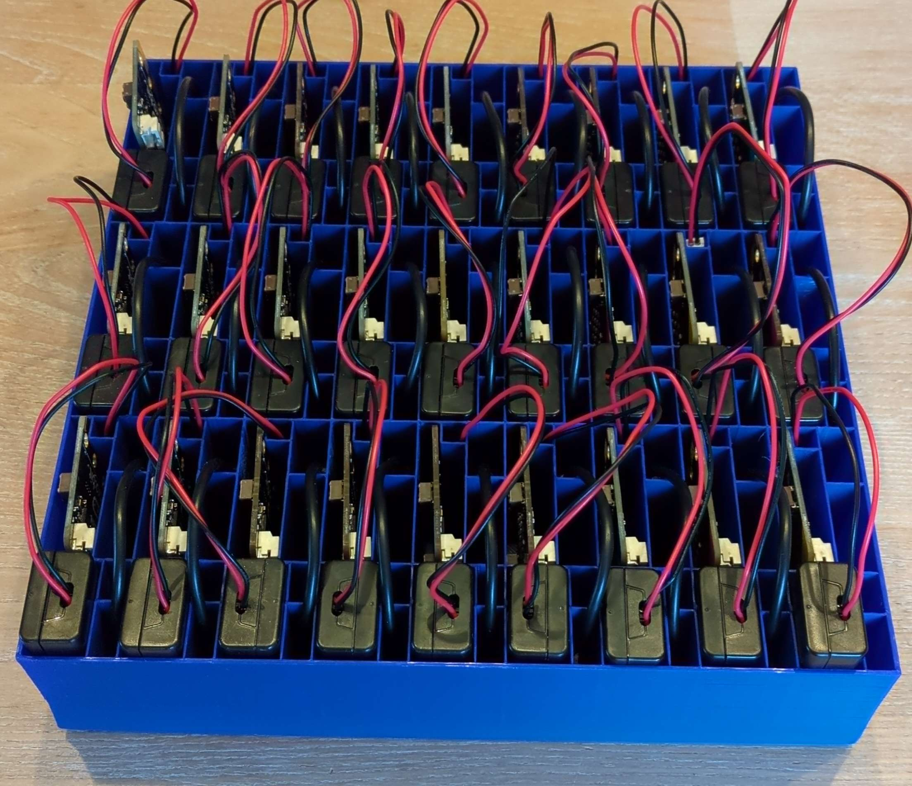
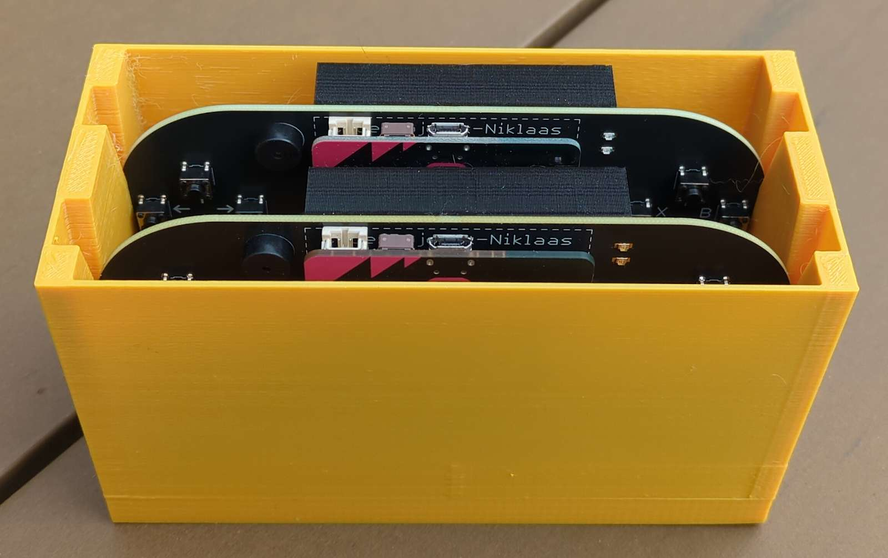
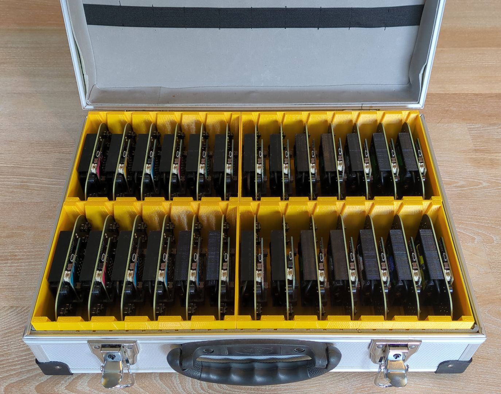

## Micro:bit, cable, and battery box holder

Print `Microbit case.stl` or choose a custom number of rows / columns by editing `Microbit case.scad` for compact storage.

## Game controller box

Controller box STL files are available to print a storage case for the game controllers. You can adjust the `Controler box.scad` file for any number of controllers.

Combine several holders so they will fit in a handy toolbox.

