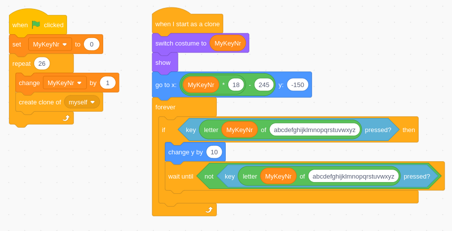

# How to develop a 26p game?

Game development is easy: each player has 1 action key. Key `a` for player 1, `b` for player 2, etc.

The limitation here is that holding keys is not supported. If a player holds down a button for 1 second, there will be no KeyDown/KeyUp events 1 second apart. Instead, the key will be repeated as long as it is pressed at a 300 ms interval.

## 26p Scratch games

Creating a 26p game in Scratch can be challenging as you don't want to duplicate code 26 times. To avoid this, the use of clones is highly encouraged.

There is a Scratch guide available (in Dutch):
[Scratch 26p game guide](https://drive.google.com/file/d/1EKSQh_yyUaG9uiFE4w32-fW5PQwD0ZBr/view)

Check out the games we already developed, ready to play! (No hardware needed, just use A–Z on the keyboard!)

[26p scratch games](https://scratch.mit.edu/studios/37038292)

## 26p HTML games

Of course games can be developed in other languages and even vibe-coded with AI. Check them out here:

[26p html games](https://justga.me/?tags=26player)

A vibe-coding guide is available (in Dutch):
[Create 26p games with AI](https://drive.google.com/file/d/1PFyaRbHaIZouSNt_Dz_1HN4087KHPSFB/view)

## 4p games

When using the game controller as the sender, 8 buttons are available for each player. There is a 4p mode available:

- On the receiver micro:bit: Press A until "4" shows up on the screen.
- On the sender micro:bits: Hold A+B until I, II, III or IIII shows up on the screen to choose player 1–4.

In this mode, the 8 keys for each player (P1–P4) are mapped like this:

Also in this mode, long-pressing keys is fully supported just like a normal keyboard.

Creating a game is then just like using a standard keyboard. There is also a Scratch guide available (in Dutch):
[Scratch 4p game guide](https://drive.google.com/file/d/1WkpQUapTLY1sVuhUzJ75bDTOG1CPytpc/view)