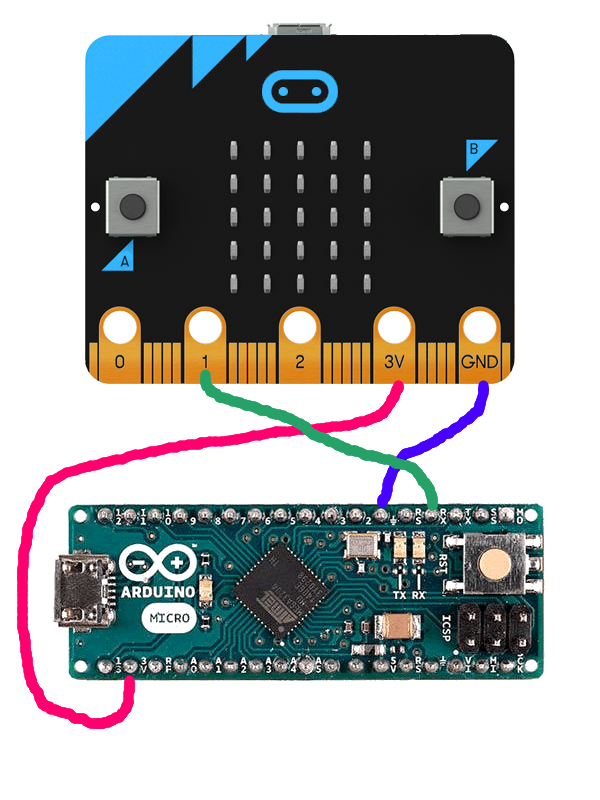
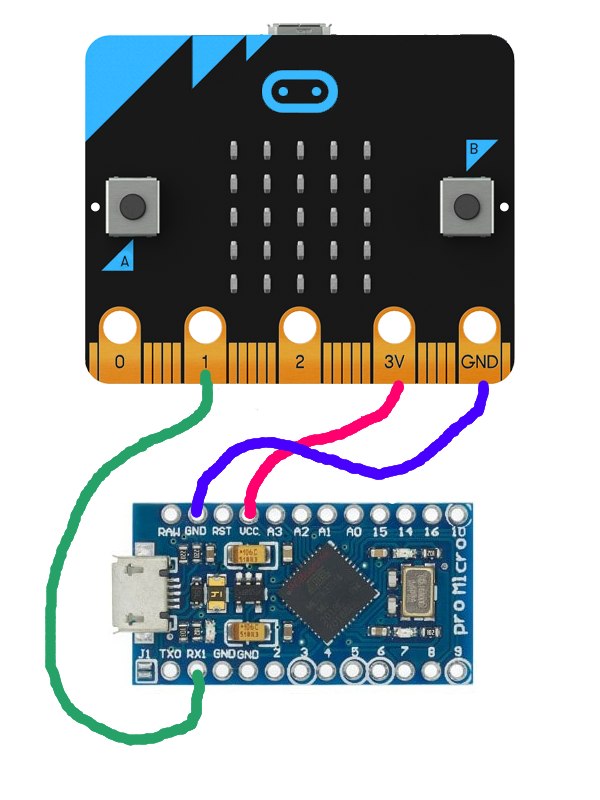
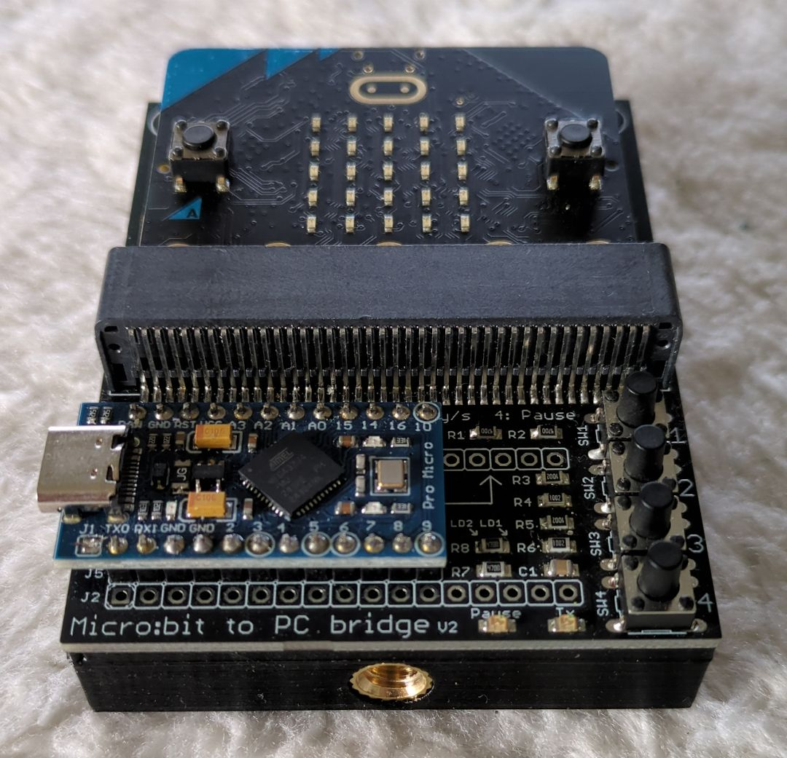

# Micro:bit to PC interface
This project will allow you to connect a micro:bit to an Arduino Micro (or a Pro Micro clone) and connect the Arduino to a computer via USB. The computer will recognize the Arduino as a native keyboard. No drivers required!

The Arduino will translate serial data from the micro:bit into USB KeyDown/KeyUp events.

## Arduino build instructions
The project can be built using VS Code with the PlatformIO add-on. Alternatively, `src/main.cpp` can be renamed to `.ino` if you are using the Arduino IDE. You will need to add the external library `arduino-libraries/Keyboard` manually.

You can tweak the constants `PLAYER_DELAY_MS`, `KEYPRESS_MIN_TIME_MS`, `KEYPRESS_MAX_TIME_MS`, and `MAX_KEYS_SAME_TIME`, but it is strongly advised to leave them as-is. These values were carefully chosen to meet most types of games (either high-volume clicker games or time-accurate "shooting" games).

Keep in mind that 26 controllers will generate a lot of keystrokes! The software is designed to handle a throughput of 26 controllers, each clicking 10 times/second, which is about the human limit of pressing a micro:bit pushbutton. The USB protocol also has a limit of 6 keyboard keys pressed at the same time. Therefore, the minimum time between a KeyDown and KeyUp event is set to 20 ms. This allows a total throughput of 300 keystrokes per second, which is about 11.5 clicks per second per controller.

The time before the same key can be sent again is set to 50 ms. This prevents cheating and buffer backlog floods. To protect even more from cheating, when the same key is received within 50 ms, the wait time will restart. This prevents a cheater from sending on a 30 ms interval, which would still result in a 60 ms interval. That is still faster than the human limit.

The keyboard layout is set to Belgium or France (AZERTY). If you use another keyboard layout, please change `KB_LAYOUT`.

## Flashing
No need to compile by yourself if you're okay with the default settings (like AZERTY and key press delays).

Use Arduino IDE or VS Code with PlatformIO to directly flash the hex file you can find in the `release` folder.

## Use without PCB

3 Wires are needed to connect the micro:bit to an Arduino Micro:

Alternatively, for a Pro Micro the wiring is different:

## Extra features when using the PCB

When using the software with our custom PCB, extra features become available:

- **Button 1 short press**: sends a keypress for the letter `a` to the computer. It is used to test if the keyboard is recognized by the computer.
- **Button 1 long press**: switches between AZERTY and QWERTY mode. If the above test sends a `q` to the computer instead of an `a`, switch modes.
- **Button 2 press**: rapidly sends all `a` to `z` keypresses with 5 milliseconds in between (26 keys in 130 ms total).
- **Button 3 press**: rapidly sends all `a` to `z` keypresses 10 times with 3 milliseconds in between (260 keys in 780 ms total).
- **Button 4 short press**: toggles mute mode. The red LED will be on to show that no keypresses are currently passed through.
- **Button 4 long press**: toggles between 1-button and 8-button mode. In 8-button mode, every player can use all 8 buttons on the game controller. Letters are prefixed by numbers to indicate which button is pressed.