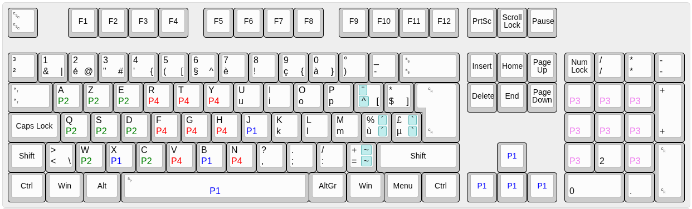

## Micro:bit 26p games receiver

This program works together with the Arduino. The micro:bit receives radio signals from the sender and sends the pressed key codes over a serial port to the Arduino, which then translates this into USB keyboard events.

Flash [microbit-GameReceiver-v26.3.hex](microbit-GameReceiver-v26.3.hex) into the micro:bit (which is connected to the Arduino) with [MakeCode](https://makecode.microbit.org/#editor) or drag it to the `MICROBIT` folder in your file manager.

## Button and LED usage

Button A toggles the mode between 26-player mode <-> Pause <-> 4-player mode.
Button B toggles through options (depending on the current mode). Press A to confirm the option.

### Modes (select with button A):
- **26-player mode**: Sends keys `a`–`z` to the computer. When a player keeps pressing their button, the key is repeated at a 300 ms interval. The 25 LEDs on the micro:bit show the online status of the a–y players.
- **4-player mode**: Sends keys from 4 controllers according to a specific mapping (see below). The LEDs on the micro:bit show a `4`, and the first 4 LEDs (top row) show the online status of the 4 controllers.
- **Pause mode**: Shows `||` on the LED screen. Keys are not sent to the computer. The option menu (Button B) has several test/debug options.

### Options (select with button B):
Not all options are available for each mode!
- **R**: Recover the player letter when a controller is turned off and on again so the player does not have to enter their code again.
- **A**: Auto-assign A–Z to controllers after power-up. Skip player numbers that were previously configured on other controllers. Also recover on power loss.
- **X**: Letter assignment A–Z is done by pressing the X button on the game controller. This allows setting a certain player order.
- **N**: Controllers do not remember their player letter and are not auto-assigned.
- **T**: Request 50 x 100 ms button A presses from 26p-configured controllers.
- **V**: Show version.
- **R**: Reset.
- **T**: Request all controllers in startup mode (showing a `?`) to send simulated button presses.
- **D**: Debug mode, custom test.
- **<**: Back without selecting this option.

## 4 player mode key mapping

## Version history
`microbit-GameReceiver-v26.3.hex`:
- Settings menu also acts as pause, new icon ||
- Button A now toggles mode26 <-> pause/settings <-fastpress-> mode4
- 4p mode defaults to X function (press X to assign)