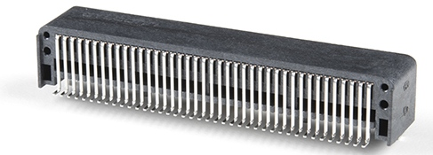
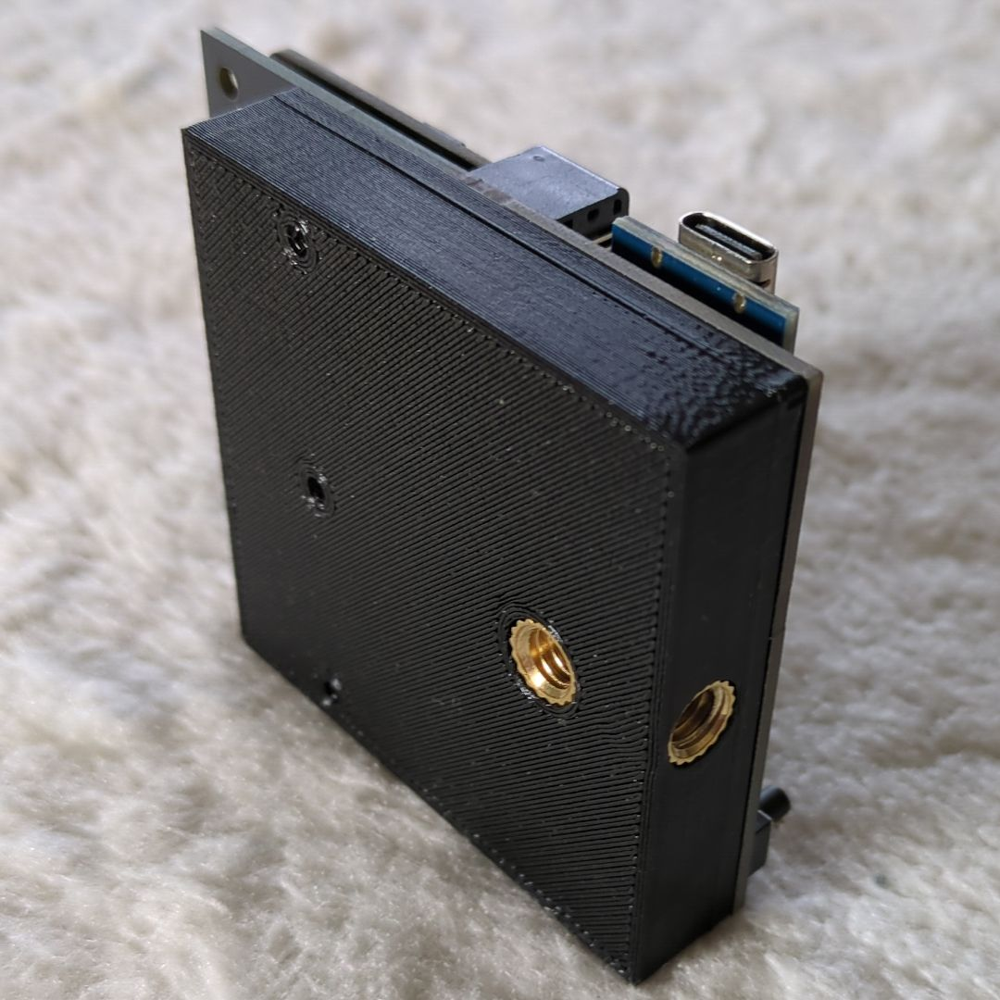

## Hardware building guide
The (empty) PCB can be easily manufactured by any PCB company, for example JLCPCB which is known as the cheapest. The (tripod) holder can be 3D printed with any 3D printer, for example the affordable Creality Ender V2 or V3.

Other parts can be ordered at various electronics suppliers such as LCSC, AliExpress, DigiKey, Farnell, etc. The most difficult part to source will be the micro:bit EDGE connector. This needs to be the horizontal SMD version, and needs to look exactly like this:

Soldering can be done with (lead-free) solder paste and a reflow oven, or if you are a bit handy it can also be done with a classic soldering iron, lead-free solder wire, and some flux. In that case, it will be handy to have something to keep the parts in place while soldering, such as a screwdriver.

## Tools needed

You'll need some tools and skills to build this project:
- A soldering iron and lead-free solder wire
- Optionally, a reflow oven OR a hot-air gun. Using this option you'll also need lead-free solder paste, such as Chipquik TS391SNL
- Recommended: Flux, such as Chipquik SMD291NL

## Step 1: Ordering the parts
Collect these parts:

Part number      |Reference	            |Description                      |Qty|Price|Order link example|
:----------------|:---------------------|:--------------------------------|--:|----:|:-----------------|
R1, R2, R7, R8   |Res 470R SMD0805      |Resistor 470R / 1% / 0.1W / 0805 |  4|€0.02|[LCSC](https://www.lcsc.com/product-detail/Chip-Resistor-Surface-Mount_YAGEO-RC0805FR-07470RL_C114564.html)|
R3, R4, R5, R6   |Res 10K SMD0805       |Resistor 10K / 1% / 0.1W / 0805  |  4|€0.06||
C1               |Cap 100nF SMD0805     |Capacitor 100nF / 50V / SMD 0805 |  1|€0.04||
SW1,2,3,4        |Pushbutton 6x6x5mm    |Pushbutton (on)-off 6x6x5mm      |  4|€0.05|[AliExpress](https://www.aliexpress.com/item/1005001897291190.html)|
J1, J2           |Pinhdr 1x17           |Pinheader 17p 2.54mm             |  2|€0.04||
J3               |Edge connector hor SMD|Micro:bit edge connector SMD/hor |  1|€0.85|[AliExpress](https://www.aliexpress.com/item/1005006206948907.html)|
J4, J5           |Pinhdr 1x12           |Pinheader 12p 2.54mm             |  2|€0.04||
LD1              |LED Green SMD0805     |Led Green SMD 0805               |  1|€0.02|[LCSC](https://www.lcsc.com/product-detail/LED-Indication-Discrete_XINGLIGHT-XL-2012UGC_C965815.html)|
LD2              |LED Red SMD0805       |Led Red SMD 0805                 |  1|€0.02|[LCSC](https://www.lcsc.com/product-detail/LED-Indication-Discrete_XINGLIGHT-XL-2012SURC_C965812.html)|
Other            |Screw M3x10           |Screw M3x10 flat head            |  3|€0.04||
Other            |1/4-20 UNC nut        |Tripod mounting insert nut       |  2|€0.10|[AliExpress](https://nl.aliexpress.com/item/1005008462611857.html)|

## Step 2: Ordering the PCB
The PCB (without components) needs to be manufactured by a company. Here are the instructions for JLCPCB:
- Create a zip file from the `Gerber-JLCPCB` folder
- Go to https://jlcpcb.com
- Choose "Add Gerber file" and upload the zip file you created
- Select your desired quantity (the more you order, the cheaper per board)
- Change PCB Color to Black
- Change Surface Finish to LeadFree HASL (if RoHS is required in your country; this is always the case for the EU)
- Choose Mark on PCB: Remove Mark  
All other options are okay by default. Complete the order process.

## Step 3: Solder the edge connector
The edge connector is preferably soldered with a soldering iron, as it is not clear if it can withstand the 240 °C hot air required for lead-free soldering. Use extra flux to create smooth joints. After soldering, remove the flux with isopropyl alcohol.

## Step 4: Solder the SMD parts
In the bill of materials above you'll find which parts belong to which part numbers printed on the PCB (such as R1, C1, ...). Only for the two LEDs does the direction of the part (polarity) matter. There is usually an indicator (like a small green dot or a line) that should point in the direction of the arrow on the PCB.

Soldering SMD parts can be done in several ways; there are many tutorials online such as https://www.youtube.com/watch?v=hoLf8gvvXXU or https://www.youtube.com/watch?v=fYInlAmPnGo.

## Step 5: Solder the pin headers and Arduino / Pro Micro
When using an Arduino Micro, solder the J1 and J2 pin headers onto the PCB. Next, place the Arduino (with the USB connector pointing to the left) over the pin headers and solder it.

When using a Pro Micro, solder J4 and J5 instead.

## Step 6: Program the Arduino / Pro Micro

Flash the hex file found in `receiver-arduino-src/release` to the Arduino / Pro Micro (using Arduino IDE or VS Code with PlatformIO).

Check if it works by unplugging and plugging the Arduino back in. Open Notepad and press button 1; an `a` (or `q`) keypress should be registered on each press.

## Step 7: 3D print the holder
This step is not required if you just want to put the PCB on a table during use:
- Download [party-games-receiver.stl](CAD-Files/party-games-receiver.stl)
- Process the file in your slicer. Recommended layer height is 0.2 mm and recommended speed is 50 mm/s.
- Print it, preferably with black PETG, as this is more fire-resistant than PLA or ABS.
- Use a soldering iron to hot-press-insert the tripod mounting nuts into the holder.

