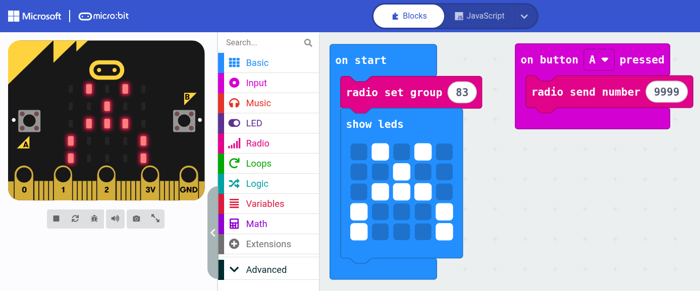

# 26p party game micro:bit controller

## The basic version (for coding exercise)

You can make the gaming experience more educational by letting the participants program their game controller by themselves!

The code above is all that is needed to have a simple 1-button game controller.

Give each participant a "secret 4-digit code" to identify their controller with a letter A–Z. Replace `9999` in the example with this code. Leave the radio channel at 83 for all players.

We chose not to send the letters A–Z directly over the radio, as this could lead to cheating or mistakes. A 4-digit code will simply work or not.

| Key Code |        | A 1461 | B 2581 |
|:---------|:-------|:-------|:-------|
| C 3327   | D 4374 | E 5717 | F 6459 |
| G 7693   | H 8352 | I 9167 | J 1986 |
| K 2118   | L 3634 | M 4773 | N 5668 |
| O 6531   | P 7922 | Q 8726 | R 9628 |
| S 1399   | T 2951 | U 3848 | V 4124 |
| W 7823   | X 8854 | Y 4975 | Z 8942 |

## The standard version (for versatile and quick setup)

Usually there is not enough time for everyone to program their micro:bit. For a quick game setup, this prebuilt program can be used, which supports all kinds of advanced modes.

Flash all micro:bits that will be used as senders with the latest [microbit-GameController-v25.12.hex](microbit-GameController-v25.12.hex) using MakeCode or drag and drop into your file manager.

## Technical details (how it works)

### 26 player mode

The player enters their "secret" PlayerCode using the A and B buttons; this maps to A–Z. Used for PC multiplayer games where each player maps to keyboard A–Z (optionally prefixed with ButtonNr).

- Each button press is sent as number `[ButtonNr][PlayerCode]` to Channel 83. Example: 41986 (J presses Left). ButtonNr: A=0, B=5, X=7, Y=9, U=8, D=2, L=4, R=6.
- When keeping key(s) pressed, the initial key being held down is repeated every 250 ms (actually 240–265 ms) as number `[1][ButtonNr][PlayerCode]`. Example: 141986 (J is holding Left).
- A keepalive message is sent every 5 s as `alive[PlayerCode]=[serial]`. Example: `alive1986=123456789` (Player J has been idle for 5 seconds or longer).

### 4 player mode

To enter this mode, hold A+B and release on I, II, III, or IIII. Used for PC multiplayer games up to 4 players with less complexity than 26-player games. All 8 buttons are available as single key presses.

- KeyUp/KeyDown events are passed through to the PC for more game features (like moving as long as a key is pressed).
- Current keys held down are repeatedly sent to CH83 as a string, prefixed by player number. Examples: '1A', '1ABXYUDLR', '8L', '8'.
- Any change in key up or down sends the current keys-down string 4 times (40 ms) to avoid stuck keys on missed messages.

### Control mode

This mode is entered on startup. A `?` is shown on screen. Exited when entering 4-, 8-, or 26-player mode.

- Every second, the controller sends key/value `hello=[serial]` to Channel 83 to announce itself. Another controller can then instruct it to enter a mode, for example to recover mode from power loss.
- When the controller enters a mode, it sends `enter[modeNr]=[serial]` 4 times. `modeNr` is 1–26 for 26-player mode, 101–108 for 8-player mode, and 201–204 for 4-player mode.
- When the controller receives `set[modeNr]=[serial]`, it will enter that mode and leave control mode. It sends `enter[modeNr]=[serial]` 4 times.
- When the controller receives `t50s[gamecode]=[serial]`, it will send the gamecode 50 times every 100 ms. When there is no gamecode, only the controllers in 26-player mode will send their gamecode (`t50f` for multikey).
- When a player presses X, Y, U, D, L, or R, a key/value of `press[button]=[serial]` is sent to CH83. This allows advanced control in assigning a mode on player request.
- When a player presses U+D+Y+A, the controller shows the version.

### micro:bit mode

Hold A+B and release on 1–8. Used for micro:bit projects like driving a car or handling a crane.

- Current keys held down are repeatedly sent to CH1–8 as a string, prefixed by player number. Examples: '1A', '1ABXYUDLR', '8L', '8'.
- Holding Y additionally sends the gyro position every 100 ms as a number, YYXX from 0000 to 9999.
- Any change in key up or down sends the current keys-down string 4 times (40 ms) to avoid stuck keys on missed messages.

### During any mode (except micro:bit mode)

- When a controller receives `reset=[serial]`, it will reset.
- When a controller receives `imgXXXXX=[serial]`, it will draw an image (1 letter = 1 row, showing bits of charcode - 60).

## Version history

`microbit-GameController-v25.12.hex`:

- Multiple keys pressed: repeat first pressed key instead of last.